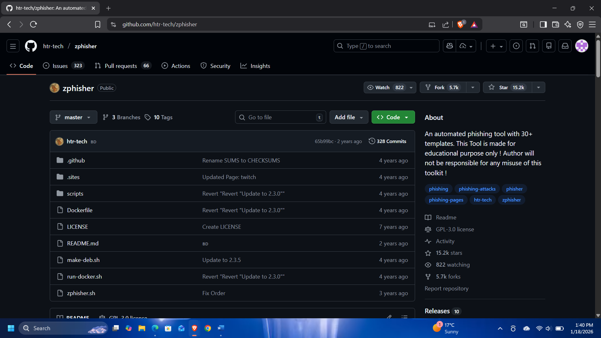
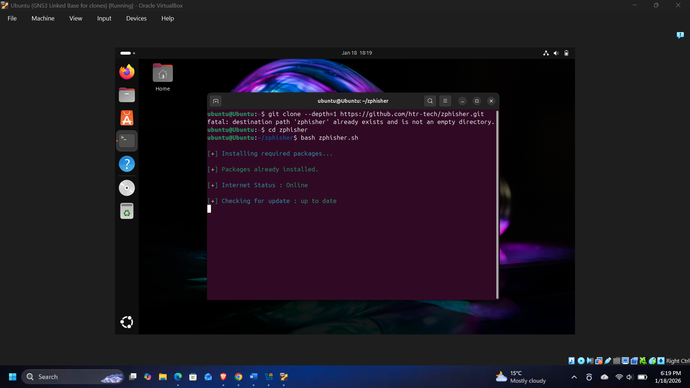
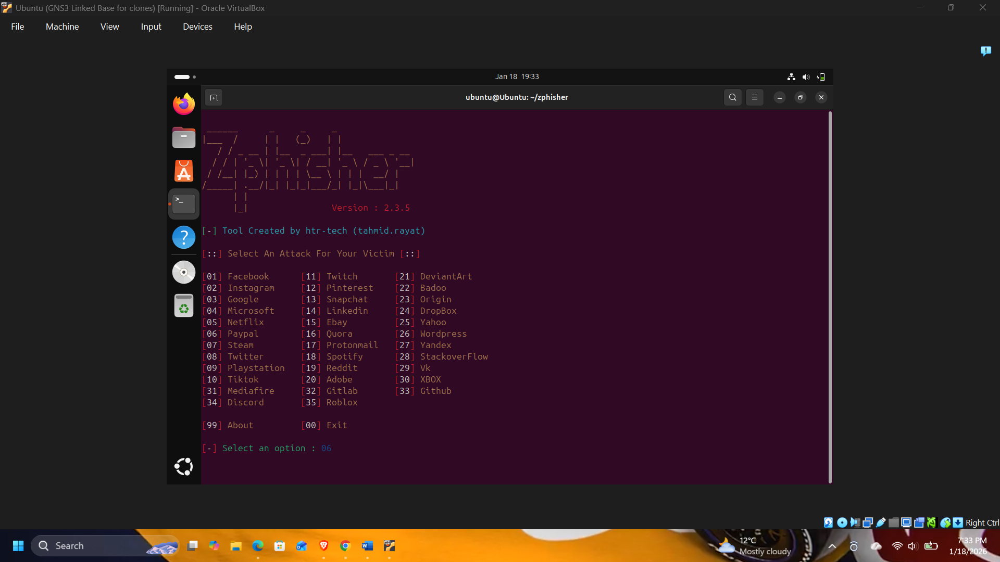
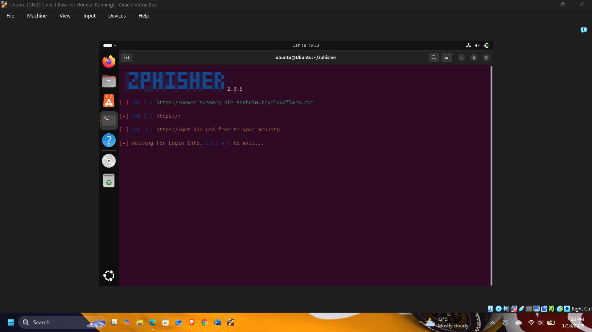
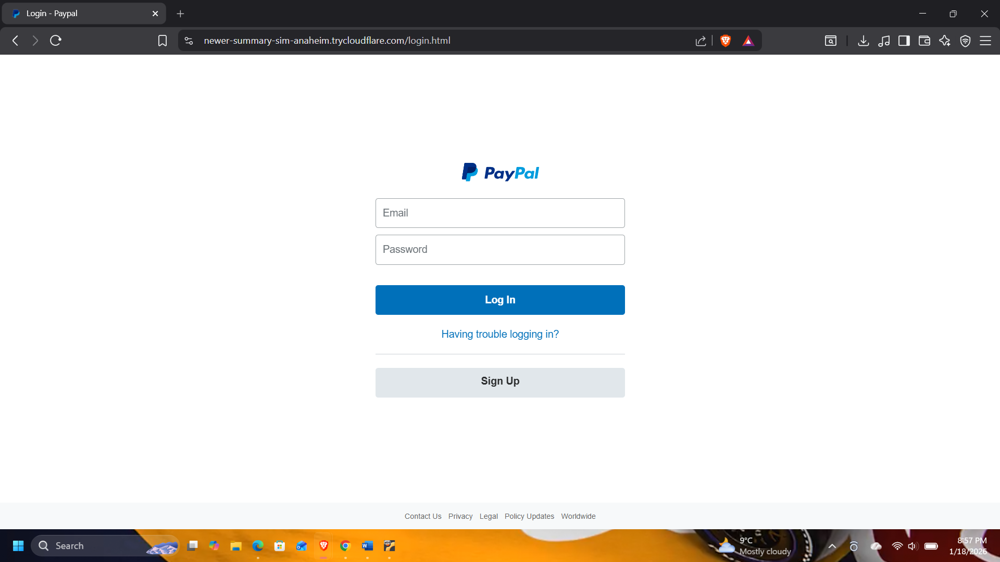

# 🔐 AI-Enhanced Social Engineering Attack Simulation & Forensic Analysis

## 📌 Overview

This project simulates a modern, AI-enhanced social engineering attack chain a cloned PayPal login page, a masked malicious URL, and an AI-generated
deepfake video of a public figure used as the trust-building lure delivered
through a simulated Instagram story. It then investigates the entire chain
from the defender's side using digital forensic techniques: AI-content
detection, URL/DNS analysis, IP infrastructure comparison, and HTML
source-code inspection.

---

## 🎯 Objectives

- Simulate a realistic, AI-enhanced social engineering attack chain, from
  lure creation to credential capture
- Evaluate how AI-generated deepfake content affects the perceived
  legitimacy and success rate of a phishing attack
- Apply digital forensic methods; AI-content detection, DNS/IP analysis,
  and source-code inspection to detect and attribute the attack after the
  fact
- Compare forensic artifacts from the cloned attack infrastructure against
  the legitimate service it impersonated

---

## 🛠 Tools & Technologies

**Attack simulation**
- Ubuntu (Virtual Machine) via VirtualBox
- Zphisher — cloned PayPal login page and phishing link generation
- URL Masker (`url-masker.vercel.app`) — masked the real destination behind
  a `paypal.com`-styled display URL
- HeyGen — AI platform used to generate a deepfake video of a public figure
  (Elon Musk) delivering a fabricated "PayPal security upgrade" announcement
- Instagram (simulated story) — delivery channel for the lure

**Forensic investigation**
- Zhuque AI Detection Assistant — synthetic video/image detection
- Sightengine — AI-generated content detection and classification
- urlscan.io — URL reputation, infrastructure, and malicious activity analysis
- nslookup.io — DNS record and hosting infrastructure comparison
- Manual HTML source-code inspection of the cloned login page

---

## ⚙️ Methodology

### 1. Lab setup
Created an isolated virtual environment (Ubuntu on VirtualBox) to contain the
entire simulation and prevent any interaction with real systems or networks.

### 2. Attack simulation
- Cloned a PayPal login page and generated a phishing link using Zphisher
- Masked the link using URL Masker, disguising the real destination behind a
  `paypal.com`-styled domain and a "verification" keyword
- Generated an AI deepfake video using HeyGen, featuring a synthetic
  representation of Elon Musk delivering a fabricated urgent security
  announcement, to increase the lure's perceived legitimacy
- Delivered the lure via a simulated Instagram story combining the deepfake
  video with the masked link
- Captured test credentials submitted through the cloned login page in the
  controlled environment

### 3. Forensic analysis
- Submitted the deepfake video to two independent AI-detection platforms to
  confirm it was synthetic
- Investigated the phishing URL's reputation and infrastructure via
  urlscan.io
- Performed DNS/IP resolution on both the cloned site and the legitimate
  PayPal site via nslookup.io, and compared the hosting infrastructure
- Manually inspected the cloned login page's HTML source code for
  attacker-planted artifacts

---

## 🔍 Key Findings

**AI-generated video detection**
- **Zhuque AI Detection Assistant** flagged the deepfake video as AI-generated
  with **99.68% probability**
- **Sightengine** independently classified it as **"Likely AI-generated" at
  99%** confidence, with a 6% face-manipulation score and diffusion-model
  attribution scores (Sora 48%, Veo 32%, Wan 13%) confirming the video was
  synthetic across two independent detection tools

**URL and infrastructure analysis**
- The masked URL (`https://paypal.com-verification@clck.ru/3RL98F`) resolved
  through a Cloudflare Tunnel domain (`newer-summary-sim-anaheim.trycloudflare.com`,
  IP `104.16.230.132`) and was flagged by **urlscan.io as "Potentially
  Malicious,"** explicitly identifying it as targeting the PayPal brand
- By contrast, the legitimate `www.paypal.com` resolved to Fastly-hosted
  infrastructure (`151.101.x.x`) with a **DigiCert EV RSA CA G2** certificate
  and registrar **MarkMonitor** a clear, verifiable difference in hosting
  maturity and certificate authority between the cloned and real sites

**Source-code inspection**
- The cloned login page's HTML contained a `<link rel="canonical"
  href="https://www.paypal.com/signin">` tag, a legitimate SEO mechanism
  that the attacker infrastructure had co-opted to falsely reference the real
  PayPal domain, likely to increase perceived authenticity and reduce the
  chance of search-engine blacklisting

**DNS comparison**
- The cloned site's DNS resolved to generic Cloudflare tunnelling IPs with no
  dedicated hosting relationship, while the legitimate PayPal domain resolved
  to a CNAME chain (`paypal-dynamic.map.fastly.net`) tied to PayPal's own
  enterprise CDN, a pattern that reliably distinguishes attacker-hosted
  clones from the real infrastructure they impersonate

**Overall**
- AI-generated video content measurably increased the perceived legitimacy of
  the lure, and URL masking successfully hid the malicious destination from a
  casual glance
- Despite the convincing front-end lure, the attack infrastructure left a
  clear and detectable forensic trail at the AI-content, DNS/IP, and
  source-code layers confirming that detection has to happen at multiple
  layers, not just by evaluating whether content "looks real"

---

## 📊 Results

The simulation successfully demonstrated a complete, realistic attack chain from AI-generated lure to credential capture and confirmed that a
structured, multi-layered forensic process (AI-content detection, DNS/IP
analysis, and source-code inspection) can reliably identify a cloned
phishing page, even when the social engineering layer is highly convincing.
The investigation also validated two real-world case studies (a 2019
deepfake-voice CEO fraud and the 2023 MGM Resorts social-engineering breach)
against the same method-opportunity-motive framework, reinforcing that human
trust not technical vulnerability remains the primary point of failure
in these attacks.

Full write-up: [View Report](report/Social_Engineering_Forensic_Analysis.pdf)

---

## 📸 Screenshots

### Zphisher setup

### AI deepfake video generation (HeyGen)

### Phishing link generation & URL masking

### Delivery via Instagram story & fake login page

### Forensic analysis results
AI-detection (Zhuque, Sightengine), URL/DNS analysis (urlscan.io,
nslookup.io), and source-code inspection screenshots are included in the full
report linked above.

---

## ⚠️ Disclaimer

This project was conducted in a **controlled lab environment for
educational purposes only**. No real users, systems, or sensitive data were
involved. All simulated attacks were contained within an isolated virtual
environment and were not deployed against any live target or real PayPal
infrastructure.

---

## 👨‍💻 Author

Ranjit Ramja
[LinkedIn](https://www.linkedin.com/in/ranjit-ramja-37951a353/) ·
[GitHub](https://github.com/RanjitRamja)
